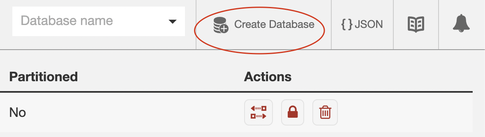

# Как запускать couchDb

## Полезные ссылки

Ссылка на официальный image: [CouchDb](https://hub.docker.com/_/couchdb).

Документация клиента на node хорошо описана вот тут [PouchDb](https://pouchdb.com/api.html#create_database).

## Запуск

1. Запуск контейнера `docker run -p 5984:5984 -d -e COUCHDB_USER=admin -e COUCHDB_PASSWORD=password --name counchdb couchdb:latest `
2. В браузере есть админка по адресу `http://127.0.0.1:5984/_utils/#/_all_dbs`.
3. В админке нужно создать базу 
4. Можно запустить `node writeToCouchDbExample.js` (сначала установить пакеты `npm install`) который создаст случайный json и положит его сначала в локальную базу PounchDB, затем в CouchDb в Docker контейнер.
